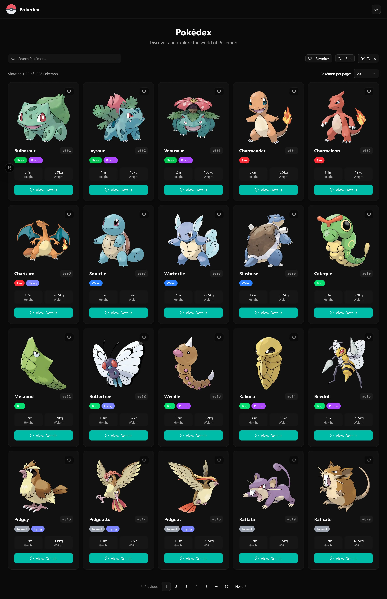
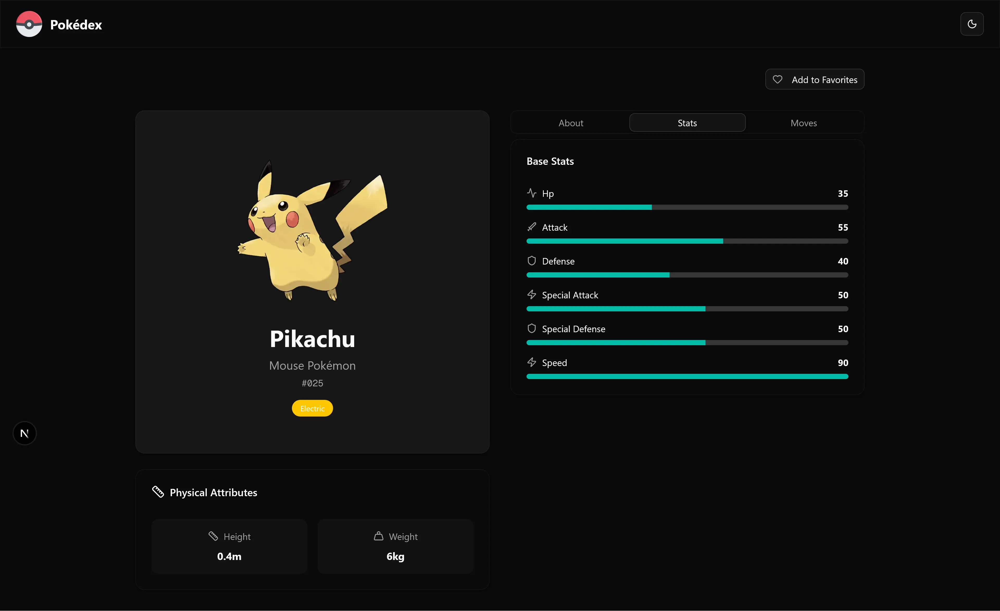

# 🧢 Pokédex App

A modern, interactive **Pokédex** built with ⚡ **Next.js 16**, 🧩 **React 19**, and powered by the [PokéAPI](https://pokeapi.co/)! You can explore, search, and favorite your beloved Pokémon!




## ✨ App Highlights

- 🔍 **Search** - Find Pokémon by name or ID number
- 🏷️ **Filtering** - Filter by type
- 📊 **Flexible Sorting** - Sort by name, ID number, or type
- ❤️ **Favorites System** - Save your favorite Pokémon locally
- 📄 **Pagination** - Smooth navigation through all Pokémon
- 🎨 **Beautiful UI** - Clean design with Shadcn components

## 🛠️ Tech Stack

- ⚛️ Next.js 16 + React 19
- 🔷 TypeScript
- 🎨 Tailwind CSS for styling
- 🧱 shadcn/ui components for beautiful, accessible design
- ⚙️ TanStack Query for smooth data fetching & caching

## 🚀 Getting Started

### Prerequisites

- Node.js 18+
- npm, yarn, or pnpm

### Installation

1. **Clone the repository**

   ```bash
   git clone https://github.com/hermanconnor/pokedex.git
   cd pokedex
   ```

2. **Install dependencies**

   ```bash
   npm install
   # or
   yarn install
   # or
   pnpm install
   ```

3. **Run the development server**

   ```bash
   npm run dev
   # or
   yarn dev
   # or
   pnpm dev
   ```

4. **Open your browser**

   Navigate to [http://localhost:3000](http://localhost:3000) to see your Pokédex!

## 🧠 What I Learned

💡 **Building this project taught me a lot about:**

- Managing **async data** with TanStack Query
- Handling state through the URL and searchParams
- Optimizing **API calls** and caching strategies
- Handling **dynamic routes** and **server-side rendering** in Next.js

## 🧗‍♂️ Challenges I Faced

🔥 **Some challenges along the way:**

- Dealing with rate limits/timeouts. I tried fetching the initial data in a server component and streaming it to a client component. However, fetching large amounts of data in a server component can timeout and throw an error. Therefore, I switched to fetching the initial data in a client component using TanStack Query
- Managing state with the URL and searchParams
- Pagination and making sure it updates correctly when searching, sorting, and filtering
- Managing TypeScript types for nested API responses

## 📝 License

This project is licensed under the MIT License.

## 🙏 Acknowledgments

- [PokéAPI](https://pokeapi.co/) for providing the comprehensive Pokémon database
- [Nikita Golubev and Flaticon](https://www.flaticon.com/free-icons/pokemon) for the Pokeball icon
